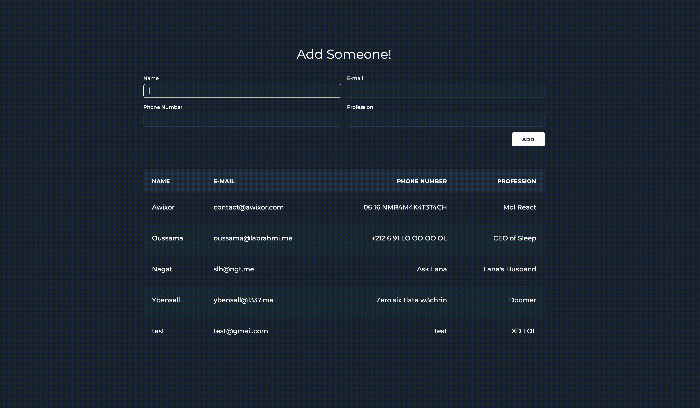

<h1>Manipulate the DOM with Vanilla Javascript</h1>

Hey There! This Repo is a follow-up to [Awixor](https://github.com/AWIXOR)'s [1337-HtML-CSS-workshop](https://github.com/AWIXOR/1337-HtML-CSS-workshop). Please make sure to check that out first and then come back to this one. Enjoy!

### Table of contents
- [Table of contents](#table-of-contents)
- [Pre-requisites](#pre-requisites)
- [Your Job](#your-job)
- [Resources](#resources)

## Pre-requisites
### - Check out [Awixor](https://github.com/AWIXOR)'s [1337-HtML-CSS-workshop](https://github.com/AWIXOR/1337-HtML-CSS-workshop).
### - `HTML` basics
### - `CSS` basics
### - `JavaScript` basics

## Your Job
Starting from the `ChadsList` directory, you will find a pre-coded static page of a table of Chad, and a form to add one to the list. Your job is to make that form work, using vanilla Javascript. Add yourself (if you're a chad) and some other chads you know. Here is an example of how it should be :

> ### ⚠️ NOTE ⚠️
> You should not touch any of the HTML or CSS. You're only allowed to edit the `script.js` file.

## Bonus
### If your JS code does what its supposed to do perfectly, why not add some bonus stuff to it? 
Improve your project by adding form validation. Check that the input values should not be either empty, contain special characters, should not be already in the Chad list... etc.

> ### ⚠️ Another NOTE ⚠️
> In the bonus part, you're allowed to add your own css. Be creative !

### Make it work
In order to see your changes directly in the browser without refreshing the page, after installing the `Live server` extention, you will need to navigate to the `index.html` file the click the `Go live` button at the bottom of VS Code, same as what is shown in the extention page [here](https://marketplace.visualstudio.com/items?itemName=ritwickdey.LiveServer).

# Resources
- [Master HTML (Darija)](https://www.youtube.com/c/ZiroToHero/playlists?view=50&sort=dd&shelf_id=1)
- [Master CSS (Darija)](https://www.youtube.com/c/ZiroToHero/playlists?view=50&sort=dd&shelf_id=2)
- [Langage JavaScript (Darija))](https://www.youtube.com/watch?v=S_GiSrBBC_Y&list=PLZgKgfug7rBvPEr-ph51Ul0tmDWKmjlLI)
- [JavaScript Algorithms and Data Structures](https://www.freecodecamp.org/learn/javascript-algorithms-and-data-structures/)
- [Learn DOM Manipulation In 18 Minutes](https://www.youtube.com/watch?v=y17RuWkWdn8)

<h3>Good luck, and happy coding!</h3>
